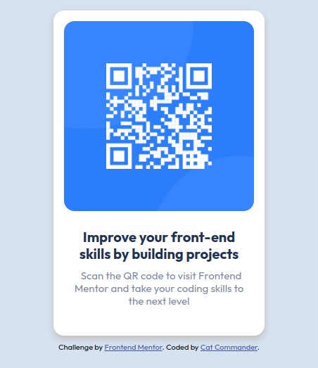

# Frontend Mentor - QR code component solution

This is a solution to the [QR code component challenge on Frontend Mentor](https://www.frontendmentor.io/challenges/qr-code-component-iux_sIO_H). Frontend Mentor challenges help you improve your coding skills by building realistic projects. 

## Table of contents

- [Overview](#overview)
  - [Screenshot](#screenshot)
  - [Links](#links)
- [My process](#my-process)
  - [Built with](#built-with)
  - [What I learned](#what-i-learned)
  - [Useful resources](#useful-resources)
- [Author](#author)
- [Acknowledgments](#acknowledgments)

## Overview

### Screenshot



### Links

- Solution URL: [Add solution URL here](https://your-solution-url.com)
- Live Site URL: [Add live site URL here](https://your-live-site-url.com)

## My process

### Built with

- Semantic HTML5 markup
- CSS custom properties
- Flexbox
- CSS Grid
- Mobile-first workflow

### What I learned

I learn how to use minmax function in CSS Grid to make my component responsive 

This is the way i use it :


```css
.container {
    background-color: white;
    display: grid;
    grid-template-columns: minmax(auto,300px);
    text-align: center;
    border-radius: 15px;
    gap: 10px;
    margin: 10px;
}
```

### Useful resources

- [resource 1](https://www.youtube.com/watch?v=NO4IeLSKNdw) - This is a youtube video that helped understanding minmax in CSS Grid for making my component responsive. NB : the video is on arabic !.

## Author

- Frontend Mentor - [@Fcommander181](https://www.frontendmentor.io/profile/Fcommander181)

## Acknowledgments

I really want to thank elzero Web School's youtube channel for helping me learning CSS very well . this is his channel [elzero web school](https://www.youtube.com/@ElzeroWebSchool).